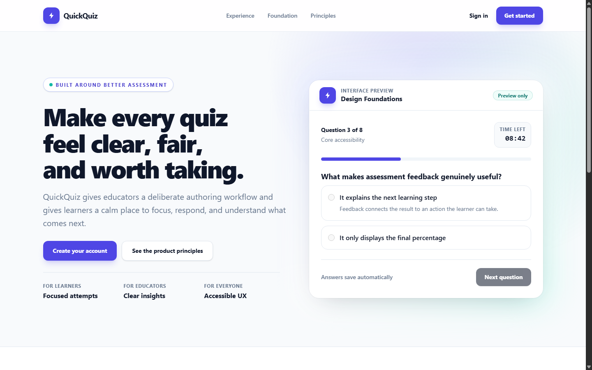
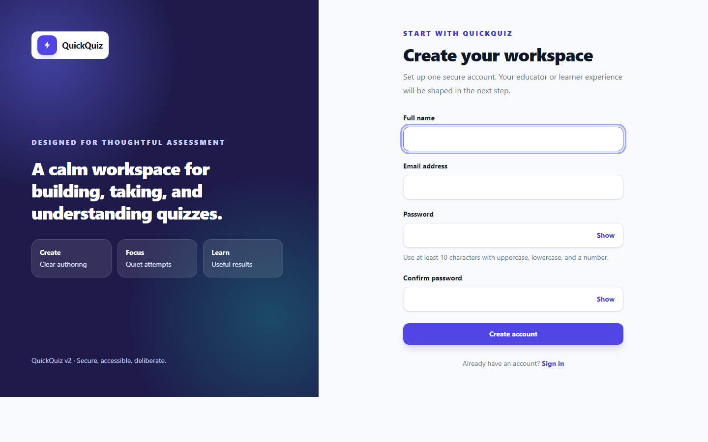
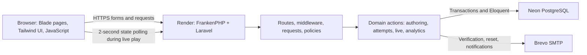

# QuickQuiz

**A calmer way to create, take, and understand assessments.**

[](https://github.com/NEMESISORION/QuickQuiz/actions/workflows/quality.yml)
[](https://www.php.net/)
[](https://laravel.com/)
[](https://quickquiz-b8uc.onrender.com/)

**Live application:** [quickquiz-b8uc.onrender.com](https://quickquiz-b8uc.onrender.com/)

QuickQuiz is a full-stack assessment platform for educators and learners. Educators build and publish quizzes, host live rooms, and study results; learners take timed assessments, review their work when permitted, and join synchronized live sessions. The current application is a Laravel rebuild of an earlier procedural PHP project, preserved at the `legacy-v1.0` Git tag.

The application is deployed on Render with persistent Neon PostgreSQL and Brevo transactional email. Its core public workflows have been manually tested; automated tests remain the repeatable verification baseline. The free Render instance may take about a minute to wake after inactivity.

## What the product does

| Educator | Learner |
| --- | --- |
| Create, duplicate, preview, schedule, publish, close, and archive quizzes. | Discover available quizzes and take timed attempts with answer saving and progress navigation. |
| Write multiple-choice and true/false questions, order them, and set points and answer-review rules. | See scores, attempt history, and answer review according to the educator's policy. |
| Host code-based live sessions, advance questions, and see answer distributions and leaderboards. | Join a live room, lock answers, follow the shared quiz countdown, and see final standings. |
| Inspect analytics, export results as CSV, and enable completion certificates. | Receive completion notifications and access verifiable certificates when eligible. |

Accounts also include email verification, password recovery, role onboarding, profile and theme preferences, notification controls, and security activity. Password fields on sign-in and registration provide a Show/Hide control.

## Product tour

### A focused introduction

The public landing page previews the assessment experience without requiring an account. It explains the separate educator and learner workflows and leads directly to sign-in or registration.

<p align="center">
  
</p>

### One account, two purposeful workspaces

Registration is followed by email verification and role selection. Educators enter an authoring workspace; learners enter a focused quiz-taking workspace. The registration form includes accessible Show/Hide password controls.

<p align="center">
  
</p>

### From authoring to insight

An educator drafts questions, previews and publishes a quiz, then reviews attempts, question-level analytics, and CSV exports. The learner sees only quizzes available to them, saves answers while taking an attempt, and receives a server-calculated result. Live rooms add a shared join code, host-led progression, a countdown, and final standings. The diagrams and flow descriptions below show how those experiences are implemented; screenshots of private workspaces are intentionally not represented by mockups.

## How it was built

The repository records a deliberate rebuild rather than a single rewrite commit:

1. **Audit and foundation:** retain the legacy release, define the v2 product and architecture, establish Laravel, Blade, a design system, local setup, and CI.
2. **Identity and access:** add registration, verification, recovery, educator/learner onboarding, authorization policies, and identity audit events.
3. **Authoring:** model quiz and question lifecycles, validation, scheduling, publishing, preview, and educator management.
4. **Assessment:** add attempt snapshots, saved answers, a server-enforced deadline, scoring, results, history, and controlled answer review.
5. **Live play:** add join-code lobbies, host-controlled question progression, synchronized learner state, responses, leaderboards, and a quiz-wide countdown.
6. **Insight and finish:** add educator analytics, CSV exports, certificates, notifications, preferences, responsive/browser-quality passes, and production-readiness checks.
7. **Public deployment:** package PHP and built assets in Docker, connect Render to Neon PostgreSQL and Brevo SMTP, then validate the public account and quiz flows.

The detailed planning and decision record is in [`docs/v2`](docs/v2/).

## Architecture



Laravel is a server-rendered monolith: the browser receives Blade pages, while application rules remain on the server. Controllers handle HTTP orchestration; Form Requests validate inputs; policies enforce ownership and role boundaries; focused classes in `app/Domain` implement operations such as publishing, submitting, scoring, expiring, and advancing. Eloquent models and migrations define persistent state. This keeps the system understandable without a separate API service or frontend deployment.

Two workflows illustrate the system design:

- **Timed assessment:** starting an attempt stores question/option and policy snapshots. The browser displays progress and a countdown, but the server decides whether answers are still valid and calculates the final score. Snapshotting protects in-progress attempts from later edits to the source quiz.
- **Live session:** a host opens a lobby and starts a published quiz. Learners join with a room code and poll a small versioned state endpoint, reloading when the question, responses, or session status changes. The host advances questions. The quiz duration starts with the session; a server-side expiry check ends it and rejects late answers. A quiz with no duration remains untimed.

PostgreSQL is shared by the web app and stores users, quizzes, attempts, live sessions, notifications, sessions, and cache data. Production does not rely on Render's ephemeral filesystem for application data. Local development and the default test run use SQLite; CI also runs the suite against PostgreSQL to catch database-specific behavior.

### Core data relationships

```text
User (educator) ──< Quiz ──< Question ──< AnswerOption
                       ├──< QuizAttempt ──< AttemptQuestion/Option/Answer
                       │          └── Certificate (when eligible)
                       └──< LiveSession ──< Participant ──< Response
User (learner) ──────────────┘                └──────────────┘
```

The authoring model holds the current quiz definition. Attempt-specific question and option copies preserve what a learner actually saw. A certificate is issued only for an eligible passing attempt; its public verification code can be checked without exposing the learner's account workspace. Live responses remain associated with the room and participant for the final leaderboard and educator report.

## Technology and why it was chosen

| Tool | Role and reason |
| --- | --- |
| PHP 8.5 + Laravel 13 | A mature framework for authentication, validation, policies, queues, mail, migrations, and testable server-side domain logic. |
| Blade + Tailwind CSS 4 + JavaScript/Vite | Fast server-rendered pages with a responsive custom interface; JavaScript is reserved for interactive controls and live polling. |
| SQLite | Zero-service local setup and fast isolated tests. |
| Neon PostgreSQL | Managed, durable production data without running a database inside the free web container. |
| Render + Docker + FrankenPHP | Reproducible PHP runtime and asset build, with a public HTTPS web service. |
| Brevo SMTP | Real transactional delivery for verification and password reset instead of log-only mail. |
| PHPUnit, Larastan/PHPStan, Laravel Pint | Behavioral tests, static analysis, and consistent PHP formatting. |
| GitHub Actions | Repeatable PHP, PostgreSQL, frontend-build, and dependency checks on pushes and pull requests. |

`neon.ts` holds the Neon CLI project configuration; the application itself connects through Laravel's PostgreSQL connection settings. No Neon Auth, storage, functions, or AI gateway integration is required for this architecture.

## Security and reliability choices

- Passwords use Laravel's authentication stack; registration and recovery are protected by validation and rate limits. Email verification gates the workspaces.
- Role middleware and policies separate educator and learner actions and enforce ownership of quizzes, attempts, and live rooms.
- CSRF protection covers state-changing browser forms. Production adds a restrictive Content Security Policy, HSTS, and other security headers; authenticated and sensitive pages are marked non-cacheable.
- Assessment deadlines, scoring, answer ownership, and live-session expiry are checked on the server. Browser timers are feedback, not the source of authority.
- Database transactions and row locks protect state transitions where concurrent requests could conflict.
- Production startup refuses missing database/mail secrets, non-HTTPS `APP_URL`, debug mode, and other unsafe settings. Secrets belong in host environment variables, never Git.

These controls reduce common risks; they are not a claim that the application has received an external security audit.

## Repository layout

```text
app/Domain/             Assessment, live-session, analytics, and certificate operations
app/Http/               Controllers, form requests, and middleware
app/Models/             Eloquent relationships and casts
app/Policies/           Ownership and role authorization
database/migrations/    Versioned PostgreSQL/SQLite schema
resources/views/        Blade screens, layouts, and UI components
resources/js/           Assessment controls and live-session polling
tests/                  Unit and feature coverage
.github/workflows/      PHP, PostgreSQL, and frontend quality gates
docs/v2/                Product, architecture, decisions, and delivery history
Dockerfile              Reproducible production image
render-start.sh         Production validation, migrations, and startup
```

## Run locally

Requires PHP 8.5 with Laravel's extensions, Composer 2, Node.js 24, and npm 11 or newer. PHP's `intl` and database extensions are needed for the full local tooling and PostgreSQL use respectively.

```powershell
git clone https://github.com/NEMESISORION/QuickQuiz.git
Set-Location QuickQuiz
composer install --no-interaction --prefer-dist
composer run setup
composer run dev
```

`composer run setup` creates `.env` and the local SQLite database if absent, generates `APP_KEY` only when needed, migrates the database, installs the locked frontend packages, and builds assets. Open the local URL printed by the development server. Never regenerate `APP_KEY` for an existing installation: it invalidates encrypted sessions and data.

Local mail defaults to the `log` driver. Verification and reset links therefore appear in `storage/logs/laravel.log` until SMTP is configured. For local demo content, run `php artisan db:seed`; the seeders are deliberately disabled in production.

| Local demo role | Email | Password |
| --- | --- | --- |
| Educator | `educator@demo.quickquiz.test` | `DemoQuickQuiz1!` |
| Learner | `learner@demo.quickquiz.test` | `DemoQuickQuiz1!` |

These accounts are for the local seeded database only; never use them on the public deployment.

## Production deployment

The [`Dockerfile`](Dockerfile) installs production PHP dependencies, builds Vite assets in a Node stage, and runs FrankenPHP. [`render-start.sh`](render-start.sh) validates essential settings, runs migrations, optimizes Laravel, and starts the web server on Render's assigned port. The production database is Neon PostgreSQL and email is Brevo SMTP.

Set secrets in Render's environment settings—not in `.env` committed to Git:

| Variables | Purpose |
| --- | --- |
| `APP_ENV=production`, `APP_DEBUG=false`, `APP_KEY` | Production mode and a stable Laravel encryption key. |
| `APP_URL` | Public HTTPS origin; on Render it can be derived from `RENDER_EXTERNAL_URL` if unset. |
| `DB_CONNECTION=pgsql`, `DB_URL` | Neon PostgreSQL connection string with TLS. |
| `SESSION_DRIVER=database`, `SESSION_SECURE_COOKIE=true`, `SESSION_ENCRYPT=true` | Durable, HTTPS-only encrypted sessions. |
| `CACHE_STORE=database`, `QUEUE_CONNECTION=sync` | Database-backed cache and inline work without a separate worker on the free service. |
| `LOG_CHANNEL=stderr`, `LOG_LEVEL=warning` | Host-collected production logs. |
| `MAIL_MAILER=smtp`, `MAIL_HOST`, `MAIL_PORT`, `MAIL_USERNAME`, `MAIL_PASSWORD`, `MAIL_FROM_ADDRESS` | Brevo SMTP credentials and a verified sender. The deployed configuration uses `smtp-relay.brevo.com` on port `2525`. |

Keep the same `APP_KEY` and database across redeploys. On the free Render instance, idle services may spin down and take longer to answer the next request; `QUEUE_CONNECTION=sync` also means email and notification work runs in the request rather than a separate worker. A paid worker and an authenticated sending domain are sensible upgrades if this moves beyond portfolio traffic. The `/up` endpoint is a process health check, not proof that email or every user workflow works.

## Engineering tradeoffs

- **Server-rendered monolith:** one Laravel application keeps deployment and data ownership simple. A separate frontend or API would add infrastructure without improving the current assessment workflows.
- **Polling instead of WebSockets:** live sessions check a compact versioned endpoint every two seconds. This is straightforward on a single free web service; higher-volume rooms would justify push transport and dedicated scaling.
- **SQLite locally, PostgreSQL in production:** local setup stays lightweight, while a dedicated PostgreSQL CI job checks compatibility with the production database.
- **Free-service limits:** Render can sleep, and synchronous jobs can extend response time. The architecture does not claim always-on latency or a durable background worker at this tier.
- **Mail sender reputation:** a verified personal-address sender is sufficient for a portfolio trial, but an authenticated custom domain with SPF, DKIM, and DMARC is preferable for serious delivery.
- **Evidence over mockups:** the product images in this README are actual public-site captures. Private educator and learner screens should only be added from real, sanitized sessions.

## Verification

```powershell
composer run verify
npm.cmd run check
composer audit --locked
```

`composer run verify` validates Composer metadata, checks Pint formatting, runs Larastan/PHPStan, and executes PHPUnit. The current suite has **229 passing tests** and covers identity, authorization, quiz workflows, scoring, live sessions, analytics, certificates, and security behavior. `npm.cmd run check` builds production assets and audits JavaScript dependencies; the audit step needs registry access. GitHub Actions additionally runs the test suite against PostgreSQL. Before calling a deployment ready, exercise registration, verification, password reset, authoring, a timed attempt, and a live session on the public site—not just `/up`.

## Project references

- [Product specification](docs/v2/PRODUCT_SPEC.md)
- [Target architecture](docs/v2/ARCHITECTURE.md)
- [Architecture decisions](docs/v2/DECISIONS.md)
- [Delivery rounds](docs/v2/DELIVERY_ROUNDS.md)
- [UX and design system](docs/v2/UX_SYSTEM.md)

The original application is available from the `legacy-v1.0` tag for comparison; v2 is the maintained implementation.
